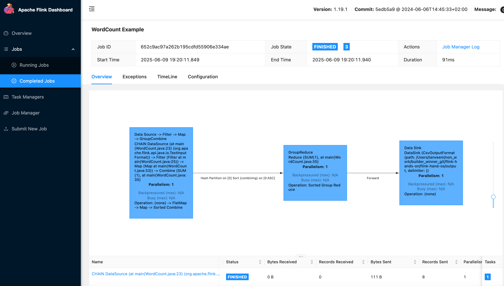

# flink-hands-on
Learn Flink and its underlying usage with examples

## WordCount Application
This is a simple WordCount application that reads text from a file, counts the occurrences of each word, and prints the results.

### Command to run the application locally
```mvn clean package
```
```/Users/tanveem/flink-test/flink-1.19.1/bin/flink run -c p1.WordCount /Users/tanveem/non_work/builder_winner_git/flink-hands-on/flink-hand-os/target/WordCount-0.0.1-SNAPSHOT.jar --input /Users/tanveem/non_work/builder_winner_git/flink-hands-on/flink-hand-os/wc.txt --output /Users/tanveem/non_work/builder_winner_git/flink-hands-on/flink-hand-os/output
```



